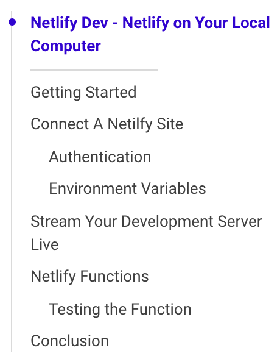

# TicTOC [](https://www.npmjs.com/package/@theiliad/tictoc)

A framework-agnostic automated table of contents component! Super simple to use, just provide a content container and another container where the TOC would be mounted, and Voila!

## Demo
Checkout the demo page [here](https://tictoc.netlify.com/).



## Getting started

### Installation:
```bash
npm i --save @theiliad/tictoc
```

## Usage
You need to create a `div` (or any other DOM element) inside of which you'd like the TOC to be mounted (in this case we're using `<div id="toc">`, as well as another element that includes your content (in this case `<div id="article-content">`.

**import/require:**
```js
import TicTOC from "@theiliad/tictoc";

new TicTOC({
  contentContainer: document.getElementById("article-content"),
  mountTo: document.getElementById("toc")
});
```

**In-browser CDN usage:**
```html
<script src="https://unpkg.com/@theiliad/tictoc"></script>
<script>
  new TicTOC({
    contentContainer: document.getElementById("article-content"),
    mountTo: document.getElementById("toc")
  });
</script>
```
